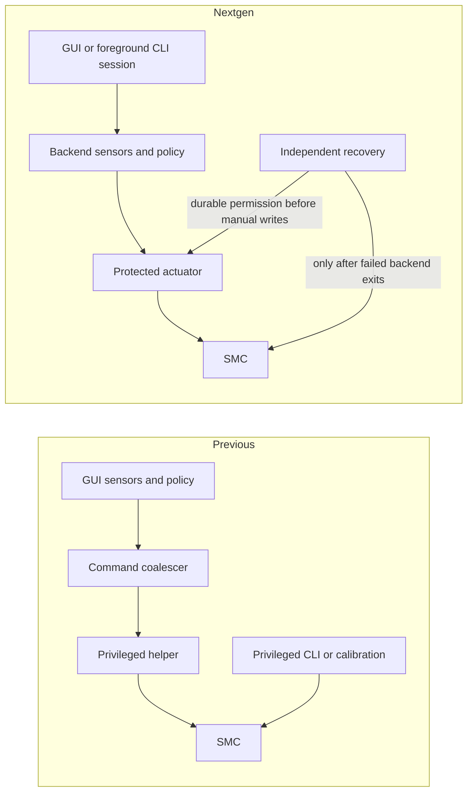

# ThermalForge

[](https://github.com/tomtastic/ThermalForge/actions/workflows/ci.yml)
[](LICENSE)
[](https://www.apple.com/macos/)
[](https://support.apple.com/en-us/116943)

Low-level fan control for Apple Silicon macOS (14+), implemented in Swift.

- Menu bar app (`ThermalForgeApp`)
- CLI (`thermalforge`)
- Privileged control backend (`com.thermalforge.daemon`)
- Independent recovery service (`com.thermalforge.recovery`)

Original creator: **[ProducerGuy](https://github.com/ProducerGuy/ThermalForge)**.
This repository is an actively maintained fork.

### Fork History

The repository lineage is
**[ProducerGuy/ThermalForge](https://github.com/ProducerGuy/ThermalForge)** →
**[mileadev/ThermalForge](https://github.com/mileadev/ThermalForge)** →
**[tomtastic/ThermalForge](https://github.com/tomtastic/ThermalForge)** (this fork).

The main changes maintained by this fork are:

- persistent profile selection and a responsive, low-overhead menu bar app
- centralized policy evaluation, cached SMC reads, and reduced hidden-UI work, building on earlier performance work from [ProducerGuy/ThermalForge#16](https://github.com/ProducerGuy/ThermalForge/pull/16) by **[arttttt](https://github.com/arttttt)**
- hardened fan recovery on launch, profile changes, app exit, expired client or completed-work leases, and sleep/wake
- machine-specific Smart calibration with safe workload selection, three accuracy modes, CSV diagnostics, and separate lid-open and lid-closed curves
- calibration and daemon status in the menu bar, plus a bundled CLI and one-click daemon installation
- typed daemon transport, runtime control decision extraction, anomaly observation, fan unlock/write consolidation, framed socket handling, and expanded tests

## Architecture

The app and CLI are clients of one serialized control backend. It owns profiles,
rules, calibration, and normal fan writes. An independent process owns recovery
from a stopped or failed backend. Both processes use one root-owned executable
under `/Library/PrivilegedHelperTools/com.thermalforge/`.

The version 2 socket protocol distinguishes requested intent, acknowledged fan
control, measured sensors, session ownership, and verified Apple handback. See
[architecture-v2.md](docs/architecture-v2.md) for the protocol and process model.

### How the flow changed from `main`

The previous implementation (`87b66e2`) distributed control between the GUI,
privileged helper, and CLI. `nextgen` makes the backend the single owner of normal
control and gives recovery its own process.

| Flow | Previous version | `nextgen` |
| --- | --- | --- |
| Profile selection | The GUI loaded profiles, sampled sensors, evaluated rules/curves, and sent coalesced RPM commands to the helper. | The GUI selects a profile in a protected session. The backend loads authoritative configuration, senses, evaluates, and applies commands serially. |
| Status display | The app's monitor combined local readings and policy state; requested commands could appear successful before hardware acknowledgement. | Clients receive a snapshot separating requested intent, acknowledged control, sensor freshness, and restoration progress. Observing never renews control. |
| Manual CLI control | Privileged CLI commands could write SMC directly, independently of the GUI/helper. | `set`, `max`, and `watch` hold foreground backend sessions. A second CLI is busy; `--takeover` explicitly revokes the GUI's session. |
| Normal exit | The GUI performed a global Apple reset, including when another client might be controlling fans. | A client releases only its own session. An observing GUI can quit without changing another owner's fans. |
| Client communication failure | The helper relied on GUI heartbeats; its watchdog and normal writes shared the same process and SMC lock. | Client renewal and completed backend work have separate ten-second leases. Status traffic cannot keep a stalled controller protected. |
| Backend crash or stall | A watchdog inside the failed helper could not independently stop it and restore fans. | Recovery revokes permission, terminates the identified backend, confirms exit, then restores and verifies Apple ownership. A durable marker survives recovery restart. |
| Reconnection | The GUI tried to restore its selected profile after helper outages. | GUI recovery resumes only eligible sessions. Recorded revocations prevent reconnection from undoing CLI takeover or explicit `auto`, including after backend restart. |
| Calibration | The privileged CLI stopped the GUI and paused/restarted the helper around its own workload and fan writes. | Calibration is an exclusive backend job using the same actuator as normal control. Observers remain connected; cancellation stops workloads before verified handback. |
| Sleep/wake | The helper saved and reapplied the previous fan command after wake. | Sleep invalidates sessions. Wake requires verified handback and a fresh selection/evaluation; stale RPM commands are not replayed. |
| Settings and calibration | Profiles/rules lived in user files; calibration could have root and user copies. | Profiles/rules are stored per authenticated console UID; machine calibration is stored once per lid state. Validated legacy imports preserve originals and respect prior backend edits. |
| Installation/removal | One helper was installed in `/usr/local/bin`; uninstall could continue after reset failure. | A protected executable serves two launchd jobs. Controllers exit before handback, recovery starts before the backend, and failed uninstall restoration retains recovery. |

The normal control paths are:



The failure path is **lease expiry or lost recovery communication → cancel/revoke
control → confirm backend exit when independent recovery is needed → restore every
fan and diagnostic override → verify ownership → allow new control**. An accepted
request starts work; it is not proof that manual control or Apple handback has completed.

The [component and failure-mode review](docs/nextgen-review.md) records the safety
and efficiency changes, interaction tests, and remaining physical release checks.

## Safety Model

The hottest CPU/GPU temperature drives the 95°C maximum-fan override, which
clears below 90°C. Rules run before profile curves. Even the Silent profile needs
a live client session for its temperature override; observers cannot cause writes.

- Client ownership expires after ten seconds without renewal. CLI `set`, `max`,
  `watch`, and calibration remain in the foreground and release their own session
  on interruption.
- Recovery uses a separate ten-second monotonic lease. Only completed sensing and
  control advances it; responsive status requests cannot conceal a stalled controller.
- Recovery durably records backend registration even while idle, and records
  manual permission before the first manual write. Registration remains until
  confirmed exit, so a recovery restart fences even an idle backend. On
  failure it revokes permission, sends SIGTERM, escalates after one second, and
  positively confirms controller exit before touching SMC.
- Every fan and any diagnostic override must report verified system/automatic
  ownership. Partial failures remain unverified and are retried; new control is blocked.
- Sleep invalidates sessions. Wake verifies Apple handback before fresh evaluation.
- Requests use an absolute two-second socket deadline. Root and the current console
  user are authorized using credentials supplied by the operating system.
- `--takeover` allows a CLI to revoke the GUI's session. The GUI remains open as an
  observer; it requires a fresh profile selection after takeover or explicit `auto`.
  A second controlling CLI receives a busy response.

The app can display local read-only sensors during an outage and marks fan ownership
unknown. GUI profile recovery after communication/backend failures cannot override
an explicit restoration or takeover, including across backend restarts.

Physical handback verification on direct-mode and `Ftst` hardware is a separate
release gate. Simulated tests verify software ordering, not firmware behavior.
Permanent SMC failures or a controller that cannot be terminated leave restoration
unverified and new manual control blocked.

## Calibration

Calibration measures the fan percentage needed to hold a set of temperatures on
the current machine. The Smart profile interpolates between those measurements
and adds a rate-of-temperature-rise adjustment. Without a valid calibration for
the current lid state, Smart uses its built-in S-curve.

Run the default Standard calibration with combined CPU and GPU stress:

```bash
thermalforge calibrate
```

Available modes use the same 60-second minimum evidence window but increasingly
strict convergence limits. A level finishes as soon as its trend, half-window
movement, and detrended uncertainty pass; uncertain levels can continue up to
the mode-specific limit:

| Mode | Minimum evidence | Maximum per fan level | Convergence |
| --- | ---: | ---: | --- |
| `quick` | 60s | 2.5 min | Fastest |
| `standard` | 60s | 4 min | Balanced |
| `optimized` | 60s | 6 min | Tightest |

Choose a mode or isolate the stress source when needed:

```bash
thermalforge calibrate --mode optimized
thermalforge calibrate --mode optimized --intensity 0.00221
thermalforge calibrate --mode optimized --rediscover-intensity
thermalforge calibrate --stress cpu
thermalforge calibrate --stress gpu
```

Calibration runs as an exclusive backend job. The app and other clients can
observe progress; cancellation and explicit Apple restoration remain available.
Use `--takeover` when the GUI owns control. It begins workload discovery at 5%, adjusts the
intensity geometrically, and makes early decisions when the result is clearly
safe or unsafe. Low CPU intensities use fractional duty cycling instead of
jumping directly to one fully loaded core. CPU, GPU, and combined runs use their
matching temperature sensors.

The sweep tests five fan levels. Unstable timeouts are excluded rather than
saved as equilibrium measurements, at least three converged points are required,
and the generated curve cannot reduce fan speed as temperature rises. The CSV
records selected, CPU, and GPU temperatures plus convergence diagnostics in the
console output. Completion and cancellation require confirmed workload termination
before verified Apple handback. Interrupted runs never save partial results or restart
automatically. `--force` is required to replace a higher-ranked calibration.

The selected stress type, workload intensity, and ambient temperature are saved
with the result. Later calibrations using the same stress type reuse that
known-safe intensity and skip Phase 1 automatically when ambient is within 3°C.
Use `--intensity` to supply a previously verified value explicitly; the 100% fan
stage still validates it against the temperature ceiling before the curve is
saved. Workload intensity is machine- and environment-specific; do not copy a
value from another Mac. Use `--rediscover-intensity` to ignore a saved workload
and rerun Phase 1.

A calibration is saved only when its converged sweep reaches at least 80°C,
providing measured coverage for the Smart control range. Underpowered sweeps and
all-maximum curves are rejected, leaving the previous calibration untouched.
GPU and combined jobs also require the requested workloads and their sensor
families to be available; GPU failure cannot silently produce CPU-only calibration.

Cancellation is accepted until the backend enters **saving**, after a complete
result, confirmed workload shutdown, and verified Apple handback. Saving finishes
that result even if the client then disconnects. Completion is reported only after
durable storage succeeds; interrupted workloads never save partial measurements.

Lid-open and clamshell operation are calibrated independently. The backend stores
both curves in `/Library/Application Support/ThermalForge/machine-calibration-v2.json`.
It prefers valid state-specific legacy root data, then authenticated user imports.
Lid-ambiguous data is never imported. Original files remain intact.

```bash
thermalforge calibrate --reset
```

Reset clears both machine curves and records a tombstone so a later legacy import
cannot resurrect them. A new completed calibration can still be saved.

## Profiles

Built-in profiles:

| Profile | Behaviour |
| --- | --- |
| `silent` | Apple auto control; ThermalForge monitors only |
| `balanced` | 55–70°C ease-in curve, up to 60%, after an 8s sustained trigger |
| `performance` | 55–65°C linear curve, up to 85%, after a 4s sustained trigger |
| `max` | 100% at 65°C after a 5s sustained trigger |
| `smart` | 53–85°C rate-aware curve, using matching machine/lid calibration when available, after a 6s sustained trigger |

Active profiles return to Apple auto at or below `50°C`; the 50–start-temperature
band preserves the current fan state to prevent rapid start/stop cycling.

The backend samples and evaluates control every second. Client display and lease
maintenance are independent; a slow CLI display interval does not expire its session.
Only acknowledged hardware operations update the published control state. Failures
return to Apple control and rebuild policy state before another evaluation.

A selected profile describes the requested policy; Apple can still own the fans
while that profile is idle below its trigger. The menu reports this as, for example,
`Smart · idle, Apple fan control`. Failed control operations, including lost sensors
or unreadable policy data, pause control, restore Apple ownership, and retain the
detailed error. Select a profile explicitly to retry. Automatic reconnection remains
available for communication/backend outages, but cannot repeatedly retry a rejected hardware
operation, even across a backend restart.

The profile picker reflects a live GUI policy. Explicit Apple control selects
Silent; a paused session or a CLI owner leaves GUI profiles unselected. A paused
Smart profile can therefore be selected again to request a fresh session.

Accepted SMC target writes may take time to become readable. The backend polls
for acknowledgement for up to two seconds per fan, without repeating the write.
Unlocking and all target acknowledgements share an eight-second budget; cancellation
or loss of manual ownership stops the operation. During these writes the menu says
`Applying fan control…`, and ownership remains unverified until completion.

## Rules (IF/THEN)

Profiles, rules, selected profile, and rule preferences are authoritative in
`/Library/Application Support/ThermalForge/users/<console-uid>/configuration.json`.
The first GUI connection imports validated legacy values atomically and preserves
the original files; explicit backend edits take precedence. Fahrenheit and launch
at login remain local preferences.

CLI:
```bash
thermalforge rules list
thermalforge rules add --trigger 55 --until 65 --max
thermalforge rules enable <rule-id>
thermalforge rules disable <rule-id>
thermalforge rules remove <rule-id>
thermalforge rules test --cpu 70 --gpu 62
```

## Install

### Source
```bash
git clone https://github.com/tomtastic/ThermalForge.git
cd ThermalForge
./setup.sh
```

Open app:
```bash
open /Applications/ThermalForge.app
```

## Build / Test

```bash
swift build
swift test
./Scripts/ci-smoke.sh
```

Release build scripts:
- `Scripts/version.sh`
- `Scripts/build-app-bundle.sh`
- `Scripts/ci-smoke.sh`

CI workflows:
- `.github/workflows/ci.yml` (build + test + package smoke)
- `.github/workflows/release.yml` (tag-based artifact release)

## CLI Quick Reference

```bash
thermalforge status
thermalforge max --takeover  # foreground; Ctrl-C releases this session
thermalforge auto             # explicit verified Apple restoration
thermalforge set 4000 --takeover
thermalforge watch --profile smart --takeover
thermalforge discover
thermalforge log --rate 10 --duration 1h --no-expire
```

`set` controls all fans; per-fan `--fan` commands are rejected. Legacy status/reset
requests remain supported, while manual requests without protected sessions are rejected.

Installation fences old controllers and verifies handback before enabling either new
service. Recovery starts successfully before the backend. Failed uninstall restoration
retains recovery and reports the failure. Automated tests do not replace installed services.

If a previous recovery job is loaded but unreachable, installation first stops it
and confirms process exit. The installer then reconciles any durable backend marker
and verifies Apple ownership before replacing the services. Failed reconciliation
retains the old recovery job and blocks installation; it does not bypass handback.

## Troubleshooting

For a recovery readiness failure, retry with the latest candidate's bundled installer:

```bash
sudo "/Applications/ThermalForge.app/Contents/Resources/thermalforge" install
```

Repairing an unreachable older job can take an additional 15 seconds. Readiness
errors include the last socket/restoration result and launchd state. Inspect a job
without changing it using `sudo launchctl print system/com.thermalforge.recovery`.

If macOS blocks the app after download:
```bash
xattr -dr com.apple.quarantine /Applications/ThermalForge.app
codesign --force --deep --sign - /Applications/ThermalForge.app
open /Applications/ThermalForge.app
```

Reset fans immediately:
```bash
thermalforge auto
```

## License

MIT
